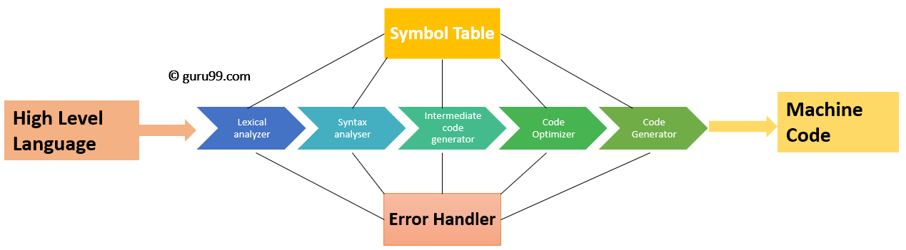

# **Compilation** #

  

This repository includes some compilers exercises, given as part of the Compilation course.
The different projects refer to the different parts of the compiler. The technologies used in these projects are:
1. Flex: https://www.geeksforgeeks.org/flex-fast-lexical-analyzer-generator/
2. Bison: https://www.gnu.org/software/bison/

Each project has its relevant description given by a pdf file. For more information, please visit these files.
